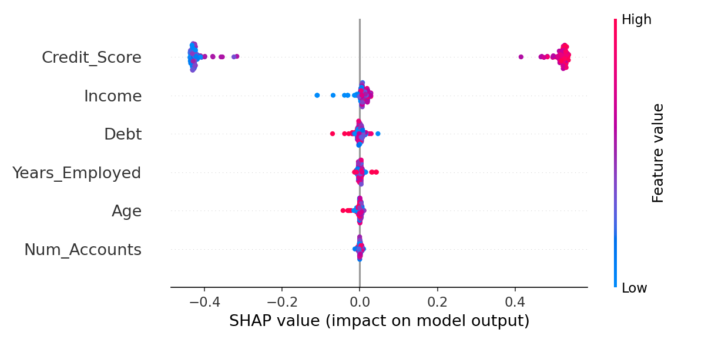

# Financial AI Explainability Module

This repository provides a practical module for **Explainable AI (XAI)** in financial machine learning models, focusing on credit risk assessment or approval prediction tasks. It includes a full example integrating SHAP (SHapley Additive exPlanations) to analyze feature contributions in a financial classification model.

## 🚀 Motivation

In financial applications, model interpretability is critical for:

* Ensuring **trust and transparency** for regulators, auditors, and users.
* Understanding **why** a model approves or rejects an applicant.
* Avoiding hidden biases that could lead to unfair or discriminatory decisions.

Traditional ML models often act as black boxes, making it difficult to understand individual predictions or feature importance. **SHAP** offers a theoretically grounded solution by fairly distributing contributions (like Shapley values from cooperative game theory).

## 💡 How it works

This module:

1. **Generates synthetic financial data**, including features like `Credit_Score`, `Income`, `Debt`, `Years_Employed`, `Age`, and `Num_Accounts`.
2. **Trains a Random Forest classifier** on this data to predict credit approval decisions.
3. **Computes SHAP values** to attribute the prediction score to each feature for each sample.
4. **Visualizes feature impacts** with SHAP summary plots and force plots.

### Feature explanation logic

* Features with higher SHAP values push predictions towards approval (or rejection).
* Visualizations highlight both **global importance** (overall across dataset) and **local importance** (specific to each instance).

## 🧑‍💻 Example usage

```bash
python xai_financial_shap_demo.py
```

This will:

* Train a classifier and evaluate accuracy.
* Save a SHAP summary plot (`shap_summary.png`) showing global feature impacts.
* Save a SHAP force plot (`force_plot.html`) showing local explanation for a single test sample.

## 📊 Outputs

* `shap_summary.png`: Global summary plot for all features.
* `force_plot.html`: Interactive local explanation for an individual prediction.

## 💬 Why SHAP?

* Provides **consistent** and **locally accurate** feature attributions.
* Well-suited to tree-based models common in credit scoring.
* Transparent for both technical and non-technical stakeholders.

## ⚖️ License

MIT License.

## 🤝 Contributions

Feel free to open issues or submit PRs to add additional explanation methods (e.g., LIME) or extend to regression use cases.

---

### ✅ Outputs



Open `force_plot.html` to explore local explanations interactively.
